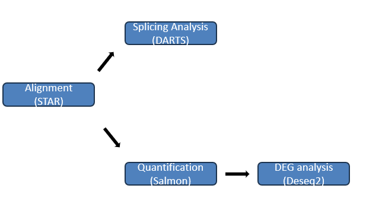

# RNA-seq

This pipeline utilizes Snakemake to perform RNA-seq analysis, including read alignment using STAR, quantification using Salmon, alternative splicing analysis using Darts. The pipeline is designed to handle multiple samples in parallel and automate the entire workflow from raw FASTQ files to TPM / alternative splicing results.

## Workflow Overview

### Alignment with STAR
Paired-end reads are aligned to the reference genome using STAR.

Aligned reads are sorted and converted to BAM/ TranscriptomeBAM format.

### Quantification with Salmon
Transcript quantification using Salmon to estimate gene expression levels.

### Alternative Splicing Analysis with Darts
RMATS counting: Counting of alternative splicing events (A5SS, A3SS, SE, RI) using Darts.

Bayesian inference: Statistical analysis of alternative splicing events to identify significant differences.

### DEG analysis with DESeq2
Gene-level differential expression analysis using DESeq2 to identify differentially expressed genes (DEGs) between conditions.
